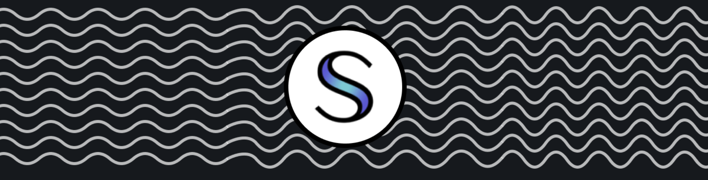

# 🚀 SCRT SYBIL




⚡️ This is the client side for SCRTSibyl, made with the developer experience in mind: Next.js, TypeScript, ESLint, Prettier, Husky, Lint-Staged, VSCode, PostCSS, Tailwind CSS.

### Features

Developer experience first:

- 🔥 [Next.js](https://nextjs.org) for a Server Side Rendered Static Site
- 🎨 Integrated with [Tailwind CSS](https://tailwindcss.com) & [Ant Design](https://ant.design/)
- 🎉 Type checking [TypeScript](https://www.typescriptlang.org)
- ✏️ Linter with [ESLint](https://eslint.org) (default NextJS, NextJS Core Web Vitals and Airbnb configuration)
- 💡 Absolute Imports
- 🛠 Code Formatter with [Prettier](https://prettier.io)
- 🦊 Husky for Git Hooks
- 🚫 Lint-staged for running linters on Git staged files
- 🗂 VSCode configuration: Debug, Settings, Tasks and extension for PostCSS, ESLint, Prettier, TypeScript
- 🤖 SEO metadata, JSON-LD and Open Graph tags with Next SEO

### Requirements

- Node.js and npm or yarn

### Getting started

Run the following command on your local environment:

```
git clone  ... my-project-name
cd my-project-name
yarn install
```

### Credentials Required

Your browser will require the Keplr Chrome extension, downloadable [here.](https://chrome.google.com/webstore/detail/keplr/dmkamcknogkgcdfhhbddcghachkejeap?hl=en)

Create a .env.local file in your root folder: 

```
PLAID_CLIENT_ID=your_client_id
PLAID_URL_SANDBOX="sandbox.plaid.com"
PLAID_SECRET_KEY_SANDBOX=your_sandbox_key

COINBASE_CLIENT_ID=your_client_Id
COINBASE_CLIENT_SECRET=your_client_secret
COINBASE_BASE_AUTHORIZE_URL=your_url
COINBASE_ACCESS_TOKEN_URL=your_url

```

You will need to create an account on [Plaid](https://dashboard.plaid.com/) OR [Coinbase](https://developers.coinbase.com/) in order to receive client ids and client secrets for your api. 


Then, you can run locally in development mode with live reload:

```
yarn dev
```

Open http://localhost:3000 with your favorite browser to see your project.

### Deploy to production

You can see the results locally in production mode with:

```
$ yarn build
$ yarn start
```

The generated HTML and CSS files are minified (built-in feature from Next js). It will also removed unused CSS from [Tailwind CSS](https://tailwindcss.com).

You can create an optimized production build with:

```
yarn build-prod
```


### License

Licensed under the MIT License, Copyright © 2022

---


Credits to [ixartz](https://github.com/ixartz/Next-js-Boilerplate) for the NextJS boilerplate
